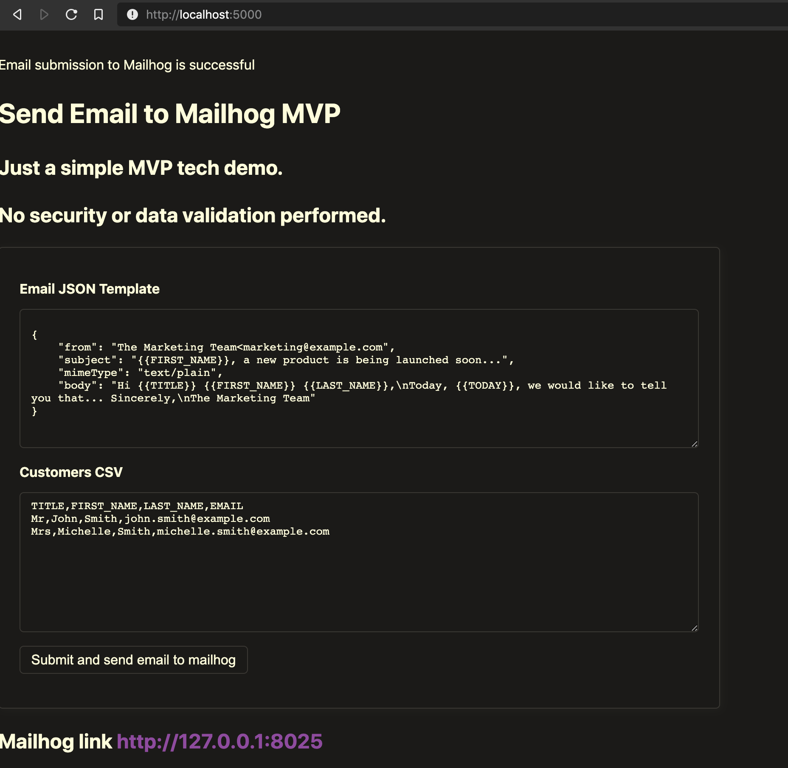
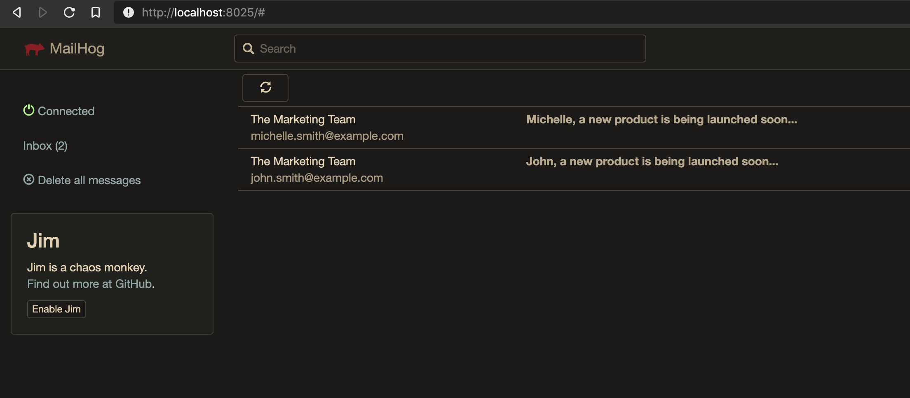

# Problem
Develop a console application to send emails using a template using one of the following
programming languages: Python

The company X wants to develop a console application to send out marketing email to its
potential customers. The marketing team has already prepared an email template for the
campaign. The email template has some placeholders like {{TITLE}},
{{FIRST_NAME}}, {{LAST_NAME}} that need to be filled with customer information.
The email template is stored in a JSON file (email_template.json) which has the
following format:

...

Notes: There is a special placeholder {{TODAY}} in the email template. The application
should automatically replace it with the date on which it runs. The format is “31 Dec
2020”
Customers are stored in a CSV file (customers.csv), which has the following format:

...

# Solution
The solution is developed in Python 3.9
* `send_email_cli.py` is a CLI application that solves above problem
* `send_email_web.py` is a bonus flask based web UI that can send emails. Use in conjunction with Docker Compose to get flask email output to mailhog container.

Note: MailHog is an email testing tool for developers

# Requirements
* Unix environment with Python 3.9 (mainly because I'm testing a new 3.9 feature to perform union on dict in `email_marketing.py:68`)
* Docker and Docker-compose (for using the flask web UI and mailhog feature)

# Assumptions
* Email template and customers file *IS* case sensitive
* Key/Value order of Json output files is not important
* Email template tags not found in CSV will NOT generate errors and instead will be blank 
  (e.g. if {{MIDDLE_NAMES}} not supplied in CSV, emails will still be generated with no middle names)
* As this is intended to be a tech demo/MVP, security concerns such as SSTI ( Server-Side Template Injection) not considered  
  
  
# Python Setup
```
# setup python virtual env
python3.9 -m venv venv
```

# Usage
For CLI application (Docker is not required)
```
source venv/bin/python3
python send_email_cli.py input/email_template.json input/customers.csv output/ output/errors.csv

# alternatively you can run the helper function in the makefile
make

# run the linters and unittests
make test
```

For Web UI Flask app
```
docker-compose build
docker-compose up
```
On a web browser:
* visit the flask web UI `http://localhost:5000/`
* modify the templates and customers csv if needed
* click the `Submit` button for flask to process 
* visit mailhog at `http://127.0.0.1:8025`
* verify the emails are correctly sent





